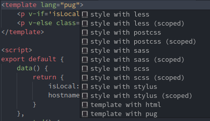

# Instructions

<details><summary>1. Try parcel instead of webpack</summary><p>

```sh
$ npm un -D webpack webpack-dev-server webpack-cli \
        vue-loader vue-template-compiler \
        css-loader file-loader \
        cross-env
```

```sh
$ npm i -D parcel-bundler
```

And update scripts in package json

```json
"scripts": {
    "dev": "parcel index.html",
    "build": "parcel build index.html"
},
```

Point index.html to `./src/main.js` instead of `dist/bundle.js`

```html
    <script src="./src/main.js"></script>
```

Update main since template compiler runtime won't be bundled by default

```js
const app = new Vue({
  el: '#app',
  render: h => h(App)
})
```

Delete `./dist` folder and `./webpack.config.js`

Include `/.cache` in `.gitignore`

Then run:

```
$ npm run build
```

Learn more about [Parcel](https://parceljs.org/) from its documentation :)

</p></details>

<details><summary>2. Try using Pug and PostCSS in *.vue</summary><p>

Changes in `environment-label.vue`:

```html
<template lang="pug">
    p.env-label.dev(v-if='isLocal') Localhost
    p.env-label.prod(v-else) Hostname: {{ hostname }}
</template>


<style lang="postcss" scoped>
    ...
</style>
```

Notice autocompletion (snippets):



</p></details>

<details><summary>3. Try scaffolding</summary><p>

Consider [vue parcel template](https://github.com/eddyerburgh/parcel-vuejs-template) for your next project

```sh
$ vue init eddyerburgh/parcel-vuejs-template my-project
```

</p></details>